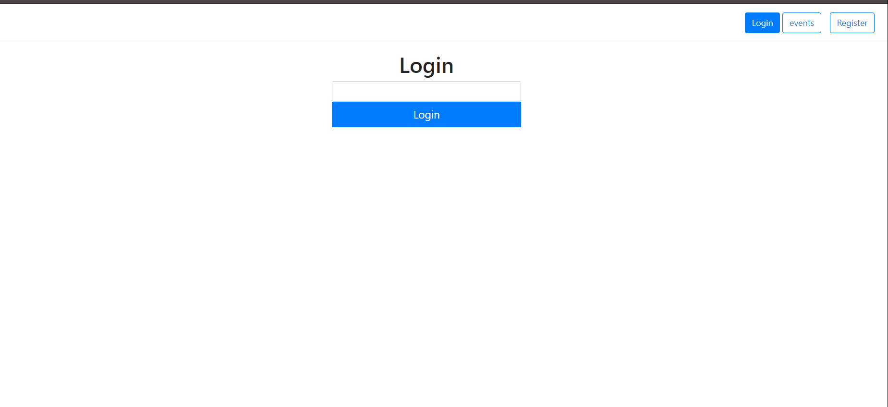

# Private Events

In this project, I built a site similar to a private Eventbrite which allows users to create events and then manage user signups. Users can create events and send invitations and parties.
Events take place at a specific date and at a location.



### Built With

- Ruby on Rails
- Ruby

Getting Started
To get a local copy of the repository please run the following commands on your terminal:

```bash
$ cd <folder>
$ git clone https://github.com/somoye123/Eventbrite.git
$ cd Eventbrite
$ bundle install
$ yarn install --check-files
$ rails db:migrate
```

## Author

**Vitalie Melnic**

- Github: [@vmwhoami](https://github.com/vmwhoami/)
- Twitter: [@vmwhoami](https://twitter.com/vmwhoami)
- Linkedin: [vitalie-melnic](https://www.linkedin.com/in/vitalie-melnic/)
